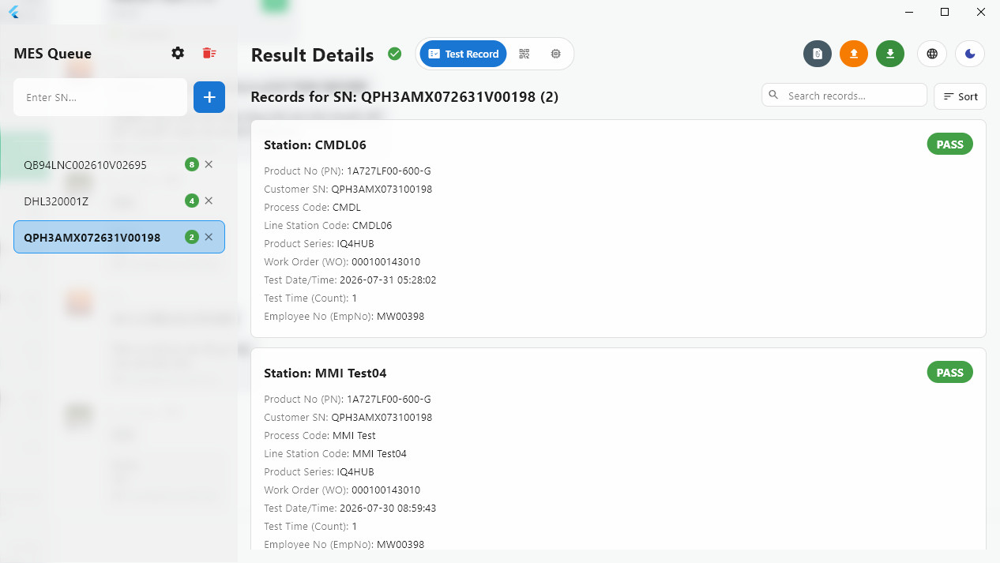
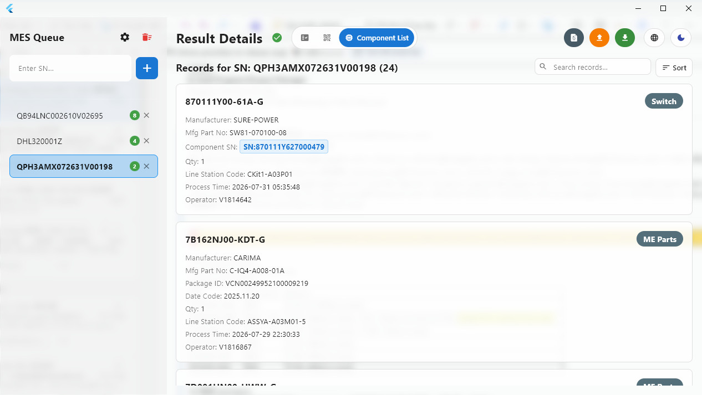
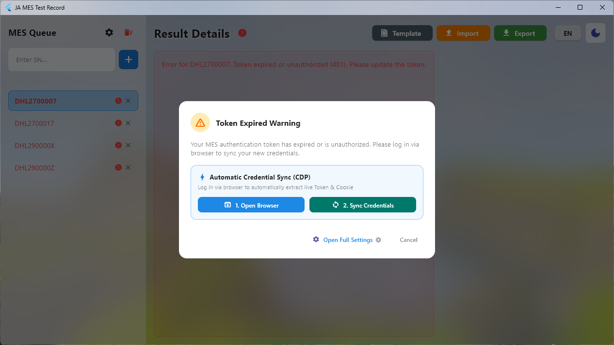
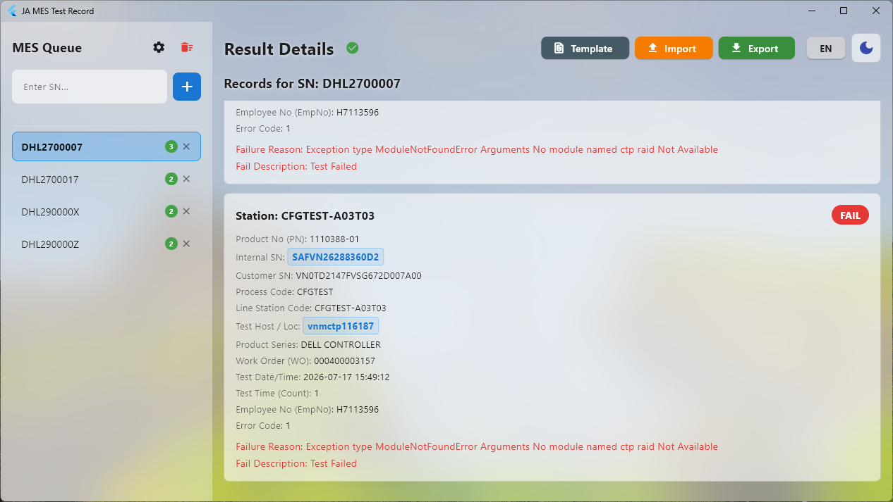

# 🤖 JA MES Tool v2.9.0 - Tiếng Việt

<p align="center">
  <br>
  <i><b>Ứng dụng desktop hiệu năng cao phát triển bằng Dart & Flutter giúp tự động hóa tra cứu, kiểm tra và xuất báo cáo dữ liệu kiểm thử, lịch sử công đoạn/barcode, và truy vết linh kiện BOM từ hệ thống Foxconn CloudMES với giao diện Bento Glassmorphism.</b></i>
</p>

<p align="center">
  
  
  
</p>

<p align="center">
  <a href="../README.md">🇺🇸 English</a> • 
  <b>🇻🇳 Tiếng Việt</b> • 
  <a href="README.zh-CN.md">🇨🇳 中文</a>
</p>

---

## 🌟 Giới thiệu

**JA MES Tool** là phần mềm chuyên dụng được thiết kế nhằm tối ưu hóa quy trình kiểm tra số Serial Number (SN), trích xuất lịch sử test/công đoạn, truy vết linh kiện BOM và xuất báo cáo từ nền tảng API **Foxconn CloudMES**.

Được thiết kế tối ưu cho kỹ sư kiểm thử và đội ngũ QA, ứng dụng mang đến khả năng tra cứu song song siêu tốc trên 3 chế độ xem dữ liệu theo SN cộng thêm chế độ tra cứu ngược Component Trace, Bảng Lệnh Nhanh (Ctrl+K) để nhảy tới mọi tab/tác vụ/cài đặt, tự động đồng bộ Token qua trình duyệt (CDP Interception), cùng giao diện Bento Glassmorphism, Liquid Glass, Dynamic Island status capsule và tìm kiếm & sắp xếp kiểu Excel.

---

## 💡 Tính năng nổi bật (v2.9.0)

### 🎨 Giao diện Bento Glassmorphism
- ⚡ **Bảng Lệnh Nhanh (Ctrl+K / Cmd+K)**: Ô tìm kiếm kiểu spotlight liệt kê mọi tab, tác vụ và cài đặt — gõ để lọc theo tên/từ khoá, dùng ↑/↓ để chọn, Enter hoặc click để chạy.
- 🌟 **Kiến trúc Bento Grid & Liquid Glass**: Thẻ Bento bồng bềnh với viền phản chiếu ánh sáng 1px trên đỉnh, độ mờ 20-24px BackdropFilter và nền quả cầu Mesh Orbs khuếch tán ánh sáng trên GPU.
- 🎛️ **Bộ 4 thanh trượt Glassmorphism Live-Preview**: Tùy chỉnh trực tiếp Độ mờ khối Bento (0-40px), Độ đục khối (5-100%), Độ mờ Hộp thoại (0-40px), Độ đục Hộp thoại (10-100%) với chế độ xem trước thời gian thực, nút Mặc định và Hủy hoàn tác.
- 🌓 **Đổi Theme 1-Click**: Chuyển đổi trực tiếp Sáng/Tối mượt mà tức thì mỗi lần nhấn.
- ⏱️ **Đọc ngày giờ Build tự động**: Tự động trích xuất thời gian biên dịch file `data/app.so` hoặc file thực thi hiển thị tại Header và mục Giới thiệu.
- ✨ **Hiệu ứng chuyển tiếp mượt mà kiểu iOS**: Chuyển tab/SN có animation fade+slide, danh sách bản ghi xuất hiện theo hiệu ứng cascade kèm cuộn có độ nảy, hộp thoại scale+fade khi mở.
- 🏝️ **Dynamic Island Status Capsule**: Sóng trạng thái kết nối MES trực quan và thanh công cụ thao tác nhanh.
- 🪟 **Glassmorphism có thể tùy chỉnh**: Cài đặt → Nâng cao có mục "Tùy chỉnh độ mờ & trong suốt" với 4 slider live-preview (Độ mờ/Trong suốt nền chính, Độ mờ/Trong suốt Dialog). Dropdown Sắp xếp và chính cửa sổ Cài đặt đều blur lại theo thời gian thực khi kéo slider — kèm sàn an toàn chống lỗi chữ chồng xuyên thấu dù chỉnh opacity thấp đến đâu.
- 🎨 **Giao diện Đa ngôn ngữ & Solid**: Hỗ trợ Light/Dark Mode và chuyển đổi 3 ngôn ngữ (**Tiếng Việt**, **Tiếng Anh**, **Tiếng Trung**).

### 🔐 Xác thực & Kết nối
- ⚡ **Tự động Cảnh báo Popup Token Hết Hạn trên Startup**: Phát hiện Token hết hạn ngay khi mở app và tự động bật Cửa sổ Popup đồng bộ 2 bước.
- 🌐 **Tương thích Đa trình duyệt Chrome & Microsoft Edge**: Tích hợp bộ cờ cách ly luồng chống treo/đứng hình cửa sổ Đăng nhập Edge (`--disable-features=msEdgeStartupBoost...`).
- 💾 **Profile trình duyệt bền vững**: Chrome và Microsoft Edge dùng profile riêng do app quản lý, giữ phiên đăng nhập, mật khẩu và bookmark sau khi mở lại app, đồng thời tránh xung đột profile.
- 🌐 **Đồng bộ Token tự động qua CDP**: Lấy chính xác 100% các thông số **Token**, **UUID**, **Operation-ID**, và **Cookie** thực tế từ lưu lượng mạng trình duyệt.
- 🛡️ **Huy hiệu Xác thực Kết nối Mới (🛡️)**: Biểu tượng khiên xác thực `Icons.verified_outlined` trực quan ở chân trang Cài đặt.
- 🔄 **Tự động Tra cứu lại Hàng đợi khi Lưu**: Tự động xóa các lỗi hết hạn Token cũ (401) và tra cứu lại toàn bộ danh sách SN trong hàng đợi khi bấm Save.
- 🔒 **Không hardcode thông tin đăng nhập**: Token/Cookie không bao giờ được nhúng sẵn trong source — người dùng tự cung cấp qua Cài đặt và chỉ lưu cục bộ vào `config.json` (không bị Git theo dõi).

### ⚙️ Lõi & Quản lý dữ liệu
- ⚡ **Hàng đợi tra cứu SN song song**: Xử lý tra cứu danh sách SN nhanh chóng theo cơ chế bất đồng bộ, trên cả 3 chế độ xem.
- 📄 **Nhập & Xuất file CSV thông minh**: Tự động bỏ qua các dòng tiêu đề (chứa chữ `"SN"`/`"CSN"`) và xuất báo cáo CSV chi tiết — 3 nút **[Tải Mẫu]/[Nhập]/[Xuất]** tự động chuyển sang mẫu/dữ liệu CSN khi đang ở tab Component Trace.
- 🛠️ **Bộ lọc & Làm sạch dữ liệu Header**: Tự động cắt bỏ ký tự xuống dòng ẩn (`\r\n`), khoảng trắng và dấu ngoặc kép thừa.
- 📋 **Quản lý Nhật ký hệ thống (Logs)**: Ghi vết theo ngày và tự động xóa các file log cũ quá 7 ngày mỗi khi khởi động.

---

## 📸 Hình ảnh Giao diện Ứng dụng

<p align="center">
  
  <br><i>Kết quả Test — tìm kiếm, sắp xếp và số lượng bản ghi trên cùng một dòng</i>
  <br><br>
  
  <br><i>Danh sách Linh kiện — truy vết BOM/vật tư theo SN</i>
  <br><br>
  
  <br><i>Cài đặt — quy trình đồng bộ Token 2 bước qua CDP</i>
  <br><br>
  
  <br><i>Popup cảnh báo Token hết hạn tự động khi khởi động</i>
</p>

---

## 🖥️ Hướng dẫn sử dụng chi tiết

### 1. Bảng Lệnh Nhanh (Ctrl+K / Cmd+K)
* Bấm **Ctrl+K** (hoặc **Cmd+K** trên bàn phím macOS) ở bất kỳ đâu trong app để mở ô tìm kiếm kiểu spotlight cho mọi tab, tác vụ và cài đặt.
* Gõ để lọc theo tên hoặc từ khoá, dùng **↑/↓** để chọn kết quả, bấm **Enter** hoặc click để chạy. Bấm **Esc** hoặc click ra ngoài để đóng.

### 2. Thêm danh sách SN
* **Thêm đơn lẻ**: Nhập SN vào ô ở cột bên trái rồi ấn **Enter** hoặc bấm nút **[+]**.
* **Nhập theo lô (CSV)**: Bấm nút **[Tải Mẫu]** để lấy file mẫu. Điền SN vào file rồi bấm **[Nhập (Import)]**. Dòng tiêu đề chứa chữ `"SN"` sẽ tự động bị bỏ qua.

### 3. Xem 3 chế độ dữ liệu
* Hover chuột vào thanh icon cạnh **"Chi tiết Kết quả"** để hiện tên, hoặc bấm trực tiếp — không cần hover trước:
  - 📋 **Kết quả Test**: kết quả Pass/Fail theo từng trạm.
  - 🔳 **Lịch sử Barcode**: toàn bộ lộ trình công đoạn/trạm của SN.
  - 🧩 **Danh sách Linh kiện**: truy vết BOM/vật tư (nhà sản xuất, mã hãng, mã ngày SX, mã lô/gói).
* Dùng **ô tìm kiếm** trên mỗi danh sách để lọc theo mọi trường, và nút **[Sắp xếp]** để chọn trường và đảo chiều tăng/giảm.
* Kéo chuột hoặc double-click vào giá trị bất kỳ để chọn, rồi **Ctrl+C** để copy — như bảng tính.
* Bấm **[Xuất (Export)]** để lưu toàn bộ dữ liệu Kết quả Test ra file CSV.

### 4. Component Trace (tra cứu ngược linh kiện)
* Bấm tab **🧭 Component Trace** — sidebar chuyển từ hàng đợi SN sang danh sách **Lịch sử Tra cứu**, và ô nhập vẫn ở vị trí cũ nhưng giờ dùng để tra cứu SN linh kiện thay vì thêm SN.
* Gõ hoặc quét SN linh kiện rồi ấn **Enter** (hoặc **[+]/🔍**) — có thể dán nhiều SN cùng lúc (mỗi dòng 1 cái, hoặc cách nhau bằng dấu phẩy) để tra hết trong 1 lần.
* Mỗi SN đã tra trở thành 1 dòng trong Lịch sử Tra cứu ở sidebar (bấm để xem lại kết quả cũ, 🔄 để tra lại, ✕ để xoá) và **được lưu xuống đĩa**, nên tắt/mở lại app vẫn còn nguyên lịch sử.
* Khung kết quả hiện toàn bộ SN sản phẩm mà linh kiện đó đang lắp vào, kèm thanh **tìm kiếm/sắp xếp** giống hệt 3 chế độ xem còn lại.
* **[Tải Mẫu]/[Nhập]/[Xuất]** tự động thao tác trên SN linh kiện khi đang ở tab này.

### 5. Tự động lấy Token từ Trình duyệt (Quy trình 2 bước CDP)
1. Mở **Cài đặt ⚙️** (hoặc thông qua Cửa sổ Popup cảnh báo Token hết hạn tự động khi vừa khởi động).
2. **Bước 1**: Nhấn nút **[1. Mở trình duyệt]** để mở Chrome hoặc Microsoft Edge.
3. Đăng nhập tài khoản MES của bạn trên trang web.
4. **Bước 2**: Nhấn nút **[2. Lấy Token]**. Phần mềm sẽ dùng cơ chế CDP Network Interception để bắt chính xác 100% **Token**, **UUID**, **Operation-ID** và **Cookie**.
5. Nhấn **Lưu** để tự động dọn dẹp màn hình lỗi cũ và tra cứu lại toàn bộ danh sách SN trong hàng đợi (kèm cả lịch sử Component Trace, nếu có).

### 6. Kiểm tra kết nối
* Đèn báo trạng thái bên cạnh tiêu đề **"Cài đặt"**:
  - 🟢 **Đã kết nối**: Token hợp lệ và kết nối tới máy chủ MES thành công.
  - 🟡 **Kiểm tra**: Token hết hạn hoặc chưa được cấp quyền (401).
* Token được tự động kiểm tra lại cứ mỗi **3 phút**.
* Nhấn **Icon Huy hiệu Xác thực (🛡️)** trong Cài đặt để kiểm tra kết nối thủ công.

---

## 🏗️ Cấu trúc thư mục dự án

```text
ja_mes_tool/
├── lib/
│   ├── main.dart                  # Điểm khởi chạy ứng dụng, Provider & khởi tạo window_manager
│   ├── modules/
│   │   ├── api_client.dart        # MES API Client: TestRecord, SnProcessRecord, WipComponentRecord & QueryInfoRecord
│   │   ├── browser_helper.dart    # Xử lý Chrome/Edge CDP & Anti-Freeze Flags
│   │   ├── build_info.dart        # Đọc thời gian biên dịch thật từ data/app.so hoặc file thực thi
│   │   ├── config_service.dart    # Đọc/ghi config.json cục bộ (không hardcode thông tin đăng nhập)
│   │   ├── constants.dart         # Hằng số toàn cục & Cấu hình mặc định (v2.9.0)
│   │   ├── logger_service.dart    # Ghi log file & Tự động dọn dẹp sau 7 ngày
│   │   ├── logic.dart             # Quản lý trạng thái: hàng đợi SN, lịch sử Trace, 4 danh sách dữ liệu, ViewMode, cache phân giải SN
│   │   ├── translations.dart      # Từ điển đa ngôn ngữ (EN, VN, CN)
│   │   └── ui/
│   │       ├── main_window.dart   # Tab, tìm kiếm/sắp xếp, hộp thoại, kết nối Command Palette (WindowListener)
│   │       ├── motion.dart        # Cấu hình Duration/Curve animation dùng chung
│   │       ├── styles.dart        # Re-export lib/theme/* (giữ tương thích ngược cho import cũ)
│   │       ├── styles_win10.dart  # Theme Win10 cũ, đã thay thế bởi lib/theme/styles_win10.dart
│   │       └── styles_win11.dart  # Theme Win11 cũ, đã thay thế bởi lib/theme/styles_win11.dart
│   ├── theme/                     # Hệ thống theme Bento Glassmorphism
│   │   ├── app_colors.dart        # Bộ token màu AppColors theo từng theme
│   │   ├── styles_win10.dart      # Tinh chỉnh màu/độ mờ kính cho Windows 10 (Aero)
│   │   ├── styles_win11.dart      # Tinh chỉnh màu/độ mờ kính cho Windows 11 (Acrylic/Mica)
│   │   └── theme_provider.dart    # ThemeProvider: chế độ sáng/tối/theo hệ thống, theo dõi đổi theme OS
│   └── widgets/                   # Component giao diện kính mờ tái sử dụng
│       ├── app_toast.dart         # Toast thông báo kính mờ, tự biến mất
│       ├── command_palette.dart   # Bảng Lệnh Nhanh Ctrl+K / Cmd+K
│       ├── filter_search_dock.dart# Ô tìm kiếm + pill lọc (giao diện kính)
│       ├── glass_dialog.dart      # Khung hộp thoại kính mờ
│       └── glass_widgets.dart     # BentoCard, MeshBackground, SlidingPillTabBar, KbdTag,...
│
├── windows/
│   └── runner/                    # Native Win32 runner (đa phần do Flutter tự sinh)
│       ├── win32_window.cpp       # Tạo cửa sổ; phát hiện Dark Mode của OS & điều hướng sang theme_win10/win11
│       ├── theme_win10.cpp        # Hiệu ứng Acrylic blur qua API SetWindowCompositionAttribute không tài liệu hóa
│       ├── theme_win11.cpp        # Nền Mica/Acrylic gốc qua DWMWA_SYSTEMBACKDROP_TYPE
│       └── resources/app_icon.ico # Icon ứng dụng (taskbar & title bar)
│
├── docs/
│   └── screenshots/                 # Thư mục chứa ảnh giao diện
│       ├── 2026-08-11_133916.jpg    # Kết quả Test — tìm kiếm/sắp xếp/số lượng
│       ├── 2026-08-11_134048.jpg    # Danh sách Linh kiện — truy vết BOM
│       ├── 2026-07-26_231301.png    # Giao diện Cài đặt & Icon Huy hiệu Xác thực
│       └── 2026-07-26_231317.png    # Popup Cảnh báo Token Hết Hạn tự động
├── i18n/
│   ├── README.vi.md               # Tài liệu Tiếng Việt (file này)
│   └── README.zh-CN.md            # Tài liệu Tiếng Trung
├── pubspec.yaml                   # File cấu hình Flutter (v2.9.0+14)
├── ABOUT.txt                      # Thẻ thông tin dự án
├── CHANGELOG.md                   # Lịch sử phiên bản đầy đủ
└── LICENSE                        # Giấy phép bản quyền
```

---

## 📖 Hướng dẫn Biên dịch & Cài đặt

### Yêu cầu hệ thống
* **Windows 10 / 11**
* **Flutter SDK 3.x** & **Dart 3.12+**
* Đã cài đặt trình duyệt **Google Chrome** hoặc **Microsoft Edge**.

### Biên dịch ra file thực thi (.exe)
```cmd
flutter build windows
```
File `.exe` hoàn chỉnh sẽ nằm tại:
`build\windows\x64\runner\Release\ja_mes_tool.exe`

---

## ⚙️ Cấu hình & Cài đặt

Toàn bộ thông tin đăng nhập được nhập qua hộp thoại **Cài đặt ⚙️** trong app (dán header thô, đồng bộ qua CDP, hoặc nhập tay) — **không có gì được hardcode trong source**. Dữ liệu chỉ lưu cục bộ cạnh file thực thi trong `config.json` (đã bị `.gitignore` chặn, không commit lên Git):

```json
{
  "token": "",
  "sns": ["SN123456", "SN789012"],
  "traceCsns": ["OPM1106349G1CCX", "QB940AE002627V05171"],
  "lang": "en",
  "operationId": "1826874274766209025",
  "uuid": "e1d5e78c-bf60-4aba-9b5f-a94b15cb63d4",
  "cookie": ""
}
```

---

## 📜 Tóm tắt Changelog

- **[2.9.0]** — Thêm **Bảng Lệnh Nhanh** (Ctrl+K / Cmd+K): ô tìm kiếm kiểu spotlight liệt kê mọi tab, tác vụ và cài đặt, lọc theo từ khoá và điều hướng bằng phím mũi tên, cùng hệ thống toast thông báo kính mờ. Đồng thời sửa lỗi leak `FocusNode` trong bảng lệnh và bỏ tham chiếu font `fontFamily` chưa được khai báo.
- **[2.8.0]** — **Đại tu Giao diện Bento Glassmorphism & Liquid Glass**: Nâng cấp toàn diện giao diện với thẻ Bento bồng bềnh, hiệu ứng Mesh Orbs chuyển động trên GPU, bộ 4 slider điều chỉnh độ mờ/đục kính mờ có Live Preview thời gian thực & Hủy hoàn tác, chuyển đổi Theme Sáng/Tối 1-Click và đọc ngày giờ build chính xác từ file compiled. Đồng thời sửa lỗi giá trị mặc định glassmorphism lần đầu mở app không khớp nút "Mặc định", rủi ro crash khi đóng dialog giữa lúc đồng bộ token, và theme không tự cập nhật khi đổi theme hệ điều hành.
- **[2.7.0]** — Thêm chế độ xem **Component Trace**: tra cứu ngược SN linh kiện để biết nó đang lắp trong sản phẩm nào, có lịch sử tra cứu riêng được lưu lại ở sidebar, tìm kiếm/sắp xếp và hỗ trợ CSV template/nhập/xuất — dùng chung ô nhập/tìm kiếm với hàng đợi SN thay vì thêm ô riêng.
- **[2.6.4]** — SN Master giờ lấy đủ dữ liệu từ API (công đoạn kế tiếp, mã lỗi, route, mã line); chip "Next" hiện công đoạn kế tiếp trên header danh sách bản ghi, label SN tự cuộn thay vì bị cắt khi hết chỗ.
- **[2.6.3]** — Chrome và Microsoft Edge dùng profile riêng có thể giữ lại, hỗ trợ chuyển profile cũ và kiểm tra CDP có giới hạn thời gian để tránh treo cửa sổ đăng nhập.
- **[2.6.2]** — Cài đặt được tách thành các tab Cài đặt nâng cao, Hướng dẫn sử dụng và Giới thiệu; chiều cao dialog tự điều chỉnh theo tab đang chọn.

Xem đầy đủ lịch sử phiên bản tại [**CHANGELOG.md**](../CHANGELOG.md).
